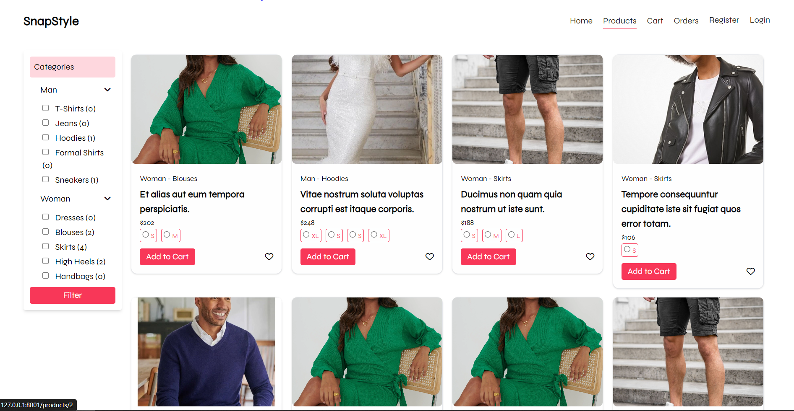
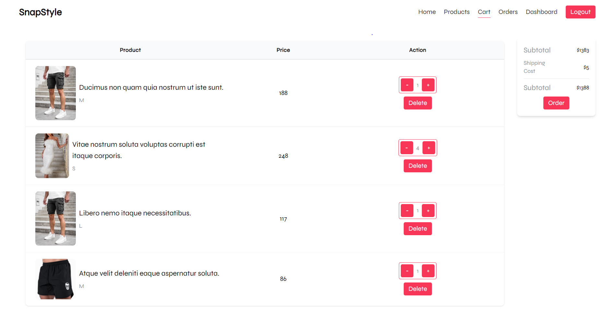
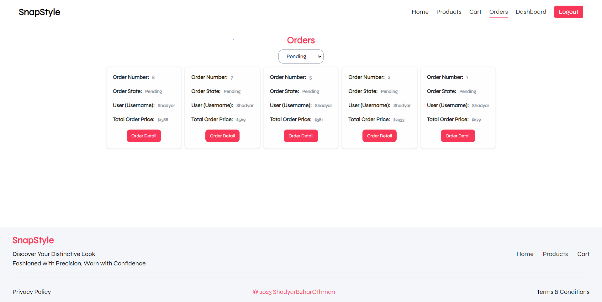
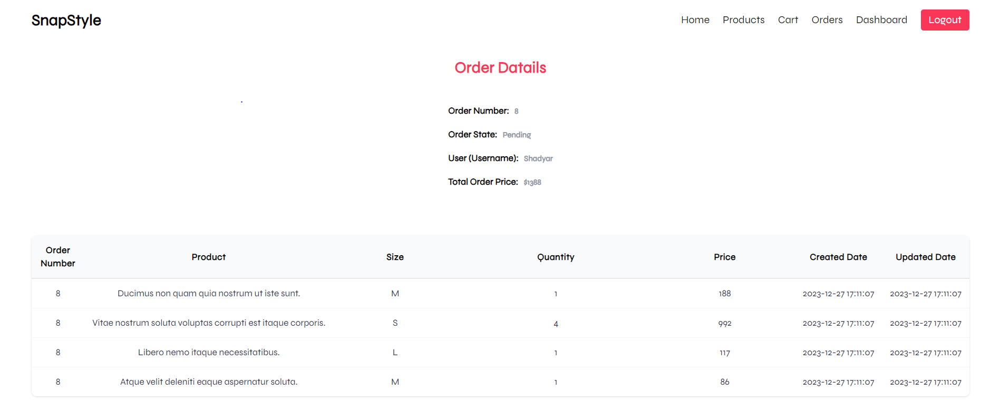
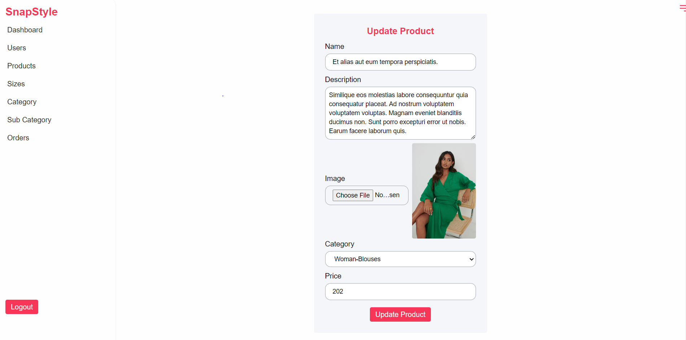
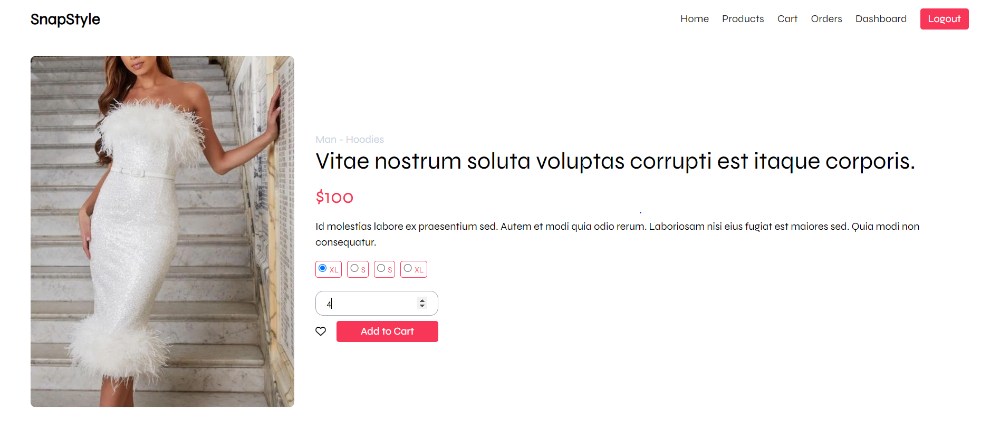
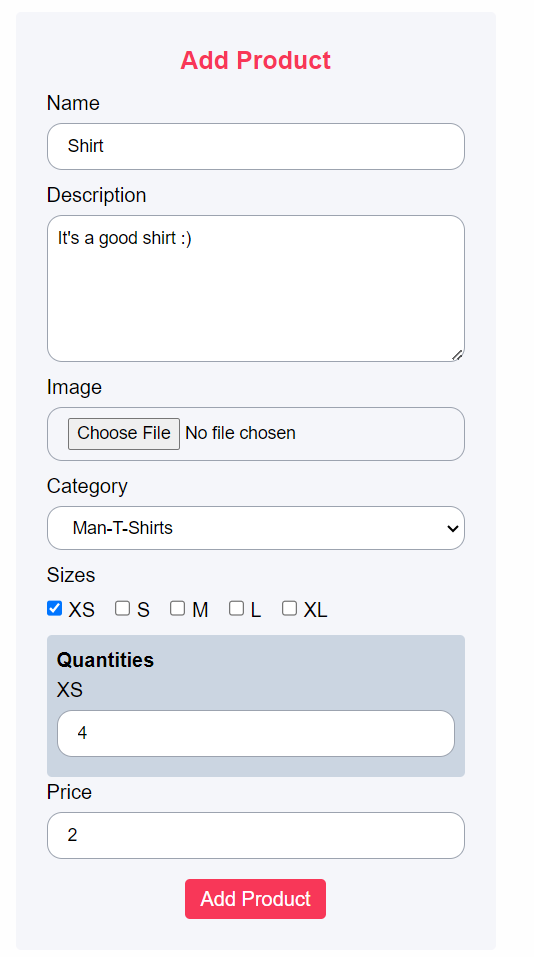
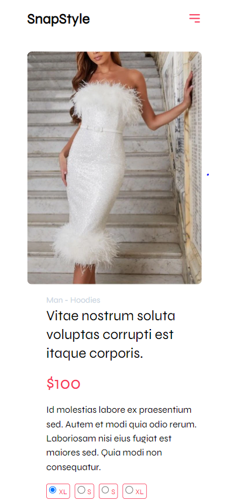

# SnapStyle (E-commerce Website)

SnapStyle Website is a Laravel-based project that utilizes Tailwind CSS for styling, Blade for templating, Alpine.js for interactive components, and MySQL for the database. It enables users to browse products, add items to their cart, place orders, search for products, manage their accounts, and more. The admin dashboard provides tools for order management, product CRUD operations, and user management

## Table of Contents

-   [Screenshots](#screenshots)
-   [Installation](#installation)
-   [Features](#features)
-   [Technologies Used](#technologies-used)
-   [Conclusion](#conclusion)

## Screenshots

|  |  |
| :-----------------------------: | :-----------------------------: |
|  |  |

|  |  |
| :-----------------------------: | :-----------------------------: |
|  |  |

|  |  |
| :-----------------------------: | :------------------------------: |

-   [Watch the video](https://drive.google.com/file/d/1nQQeSL5EpP6vtOGYtK3PjKGtoxyDL1tT/view?usp=sharing)

## Installation

To run the website locally, follow these steps:

**Step 1:**

Download or clone this repo by using the link below:

```
https://github.com/Shadyar-Bzhar-Othman/SnapStyle-laravel.git
```

**Step 2:**

Go to project root and execute the following command in console to get the required dependencies:

```
composer install
```

**Step 3:**

Create a database (mysql) named (SnapStyle) and the execute the following command to setup the database:

```
php artisan migrate --seed
```

**Step 4:**

Run the website:

```
php artisan serve
```

## Features

-   View products
-   Add products to the cart
-   Place orders
-   Search for products
-   User account creation and management
-   Admin dashboard with order management
-   CRUD operations for product categories, subcategories, and sizes

## Technologies Used

-   Laravel (Backend)
-   Tailwind CSS (Styling)
-   MySQL (Database)
-   Blade (Templating)
-   Alpine.js (Frontend Interactivity)

## Conclusion

I will be happy to answer any questions that you may have on this project, and if you want to lend a hand with the SnapStyle Website project then please feel free to submit an issue and/or pull request 😁

If you liked my work, don’t forget to ⭐ star the repo to show your support.
